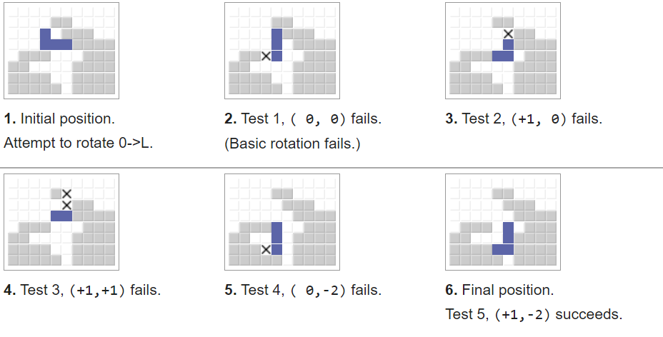

# Challenage of Tetris

 

## Installation Steps
- Unzip the Tetris.swiftpm.zip
- Built and run Xcode 13.3 on macOS 12.3

Note:Please use the model newer than iPhone 11 to get the best experience,I prefer using iPhone 13 mini to run it because I used it when I was developed the game.
 
## Overview

Tetris is a well-known puzzle game, a game of brainstorming to clear as many lines as possible to get points. And in the history of the game, there is a branch game mode called battle mode, two people give the obstacle named "garbage" to the opponent by clearing the lines, the goal is to see who can survive the game as long as possible. And on the rotating system, the battle also has different rules from the classic Tetris. At present, the games on the market are mainly based on the rules of classic Tetris, So as a fan of Battle Tetris games, I designed such a stand-alone game. During the game, you will be attacked by "Garbage" from time to time, and a special rotation system has also been introduced. By showing a different look Tetris ,I hope to promote to everyone and let more people feel the fun of Battle Tetris!

## How to play?

### Basic rules
- Tetris block keeps falling until it hits the ground
- During the period, you can perform operations on the blocks
- After landing, there is still a 0.5 second delay to continue the operation
- A col will be cleared when the block is completely filled
- You will get a point when you clear a line
- And the "Garbage" event occurs every 15 seconds during the process
- The game is over when it reaches 2 minutes or the block generation position is blocked

Goal: Get as high as possible score before the game ends

### Basic operations
- move left and right
- Rotate clockwise and counterclockwise
- support Standard Rotation System(SRS)

### Garbage system
	
Every once in a while there will be 1 - 8 lines of Garbage (a black square with a col occupying 9 spaces) rise from below the game board, They will be a strong obstacle but also a good time to get points quickly.

### Standard Rotation System (SRS)
SRS is the current Tetris Guideline standard for how tetris block behave,
If the rotated position of a block is blocked, the block cannot be rotated, But SRS sets the center coordinate axis offset of the block to make it possible. Combined with counterclockwise and clockwise rotation, more complex and difficult actions of the block can be realized. The following is an actual example on Wiki, This system makes the Tetris game more playable, and in this game I also added the standard version of the SRS system

 

